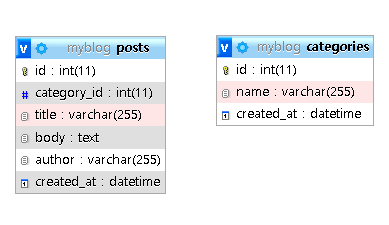

## PHP REST API From Scratch [1] - Database & Read

1. <https://www.youtube.com/watch?v=OEWXbpUMODk>

## PHP REST API From Scratch [2] - Single & Create

2. <https://www.youtube.com/watch?v=-nq4UbD0NT8&t=958s>

## PHP REST API From Scratch [3] - Update & Delete

3. <https://www.youtube.com/watch?v=tG2U18EmIu4>

## 전체 구조

```
restApi3
├─ .gitignore
├─ api
│  ├─ category
│  │  └─ read.php
│  └─ post
│     ├─ create.php
│     ├─ delete.php
│     ├─ read.php
│     ├─ read_single.php
│     └─ update.php
├─ config
│  └─ Database.php
├─ models
│  ├─ Category.php
│  └─ Post.php
├─ myblog.sql
└─ README.md
```

## REST API
- GET
  - posts 전체 데이터 조회
    http://localhost/restApi3/api/post/read.php
  - posts 싱글 데이터 조회
    http://localhost/restApi3/api/post/read_single.php?id=3
  - categories 전체 데이터 조회
    http://localhost/restApi3/api/category/read.php

- POST
  - posts 데이터 생성
    http://localhost/restApi3/api/post/create.php
  - {
    "title": "기술 포스트",
    "body": "샘플 데이터 포스트",
    "author": "조상호",
    "category_id": "1"
    }

- PUT
  - posts 데이터 업데이트
    http://localhost/restApi3/api/post/update.php
  - {
    "title": "기술 포스트 수정2",
    "body": "샘플 데이터 포스트",
    "author": "조상호",
    "category_id": 1,
    "id": 7
    }

- DELETE
  - posts 데이터 삭제
    http://localhost/restApi3/api/post/delete.php
  - {
    "id": 4
    }

## MySQL 테이블


## 개발 환경
1. 윈도우 10 프로
2. XAMPP 8.1.2
3. Visual Studio Code
4. Postman
